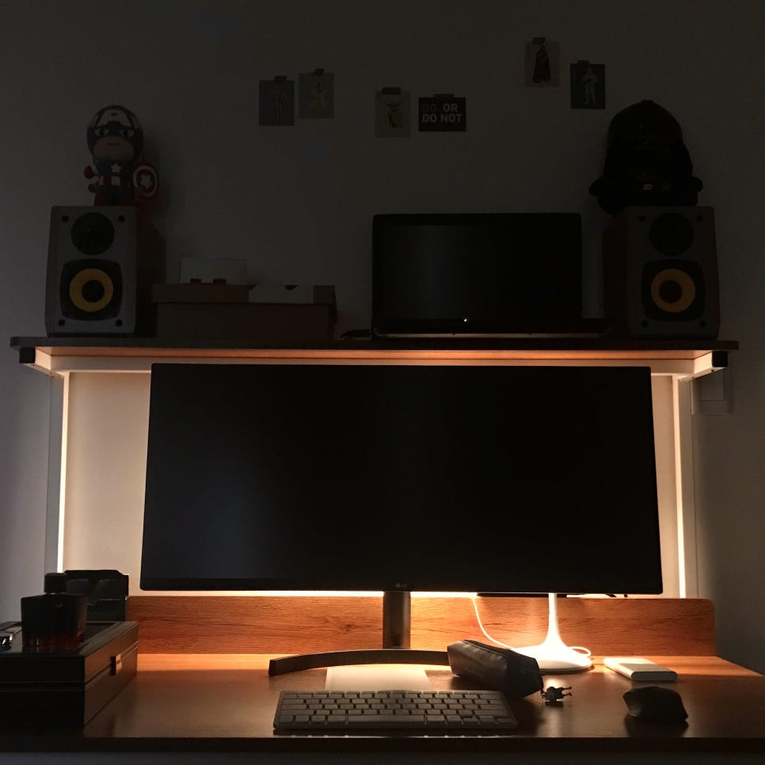

올해였나 작년이었나, 옆집에 소동이 있었다. 거주하는 할머니께 연락이 닿지 않는다며 신고가 접수된 모양이었다. 경찰과 소방관 분들이 문을 따기 위해 몇 시간을 북적북적 모여있었다. 그 뒤로는 어떻게 됐는지 모른다. 잘 살아만 계신다면야 이제 다른 집 사정이니 알아야 할 이유도 없다. 다행이라고 할지, 이전엔 몰랐던 얼굴을 기억하게 됐고 마주칠 때 반갑게 웃어드릴 수 있게 됐다.

---

요며칠은 다리 근육이 평소보다 열심히 일을 하고 있다. 의도한 건 아니고, 한 달을 훌쩍 넘게 진행되는 엘리베이터 교체 공사 때문에 계단을 오르내리는 것 말고는 안팎을 드나들 방법이 없기 때문이다. 다행히 층고가 높지 않아 감당하기 힘든 정도는 아니지만, 쓰레기 배출이나 택배 수령 같은 것들에서 골치가 아프게 됐다. '익숙함에 속아 소중함을 잊고 있었던' 꼴이다. 아니지, 아픈 곳은 골이 아니라 다리다.

평생을 같이 한집에서 지내왔던 할아버지께서는 아흔 둘의 연세로 지난 6월 명을 다하셨다. 가족 구성원과의 작별은 처음인지라 아직도 실감을 하지 못하며 지내던 차, 만약 지금까지 살아계셨다면 상황 참 곤란했겠다는 상상을 했다. 연세 때문에 외출할 일이 얼마나 있으실지 싶을 수 있지만, 그 불편한 몸을 이끌고 시내버스에 몸을 실어 노인복지관에 주마다 한 번은 출석을 하셨던 분이다. 취침, 기상, 식사를 분 단위로 정하고 움직이시던 계획적인 분이기도 했다. 한창 활기가 넘치고 주도적으로 살아야 할 나이의 나조차 그 정도의 부지런함과 철저함은 반의 반만큼도 따라갈 자신이 없다. 아무튼 그런 분께도 매 외출마다 계단을 그만큼 오르내려야 할 상황은 결코 감당하기 쉽지 않았을 터다.

---

청소년기 중 대부분을 방 없이 거실에서 보냈다. 그러다가 수감 생활을 하는 동안 집이 넓은 곳으로 이사를 하면서, 출소와 동시에 내게도 방이 생겼다. 시공간적 자유와 개인 공간을 한순간에 얻어버린 것이다. 다만 욕심을 버리는 것을 맨정신 보존 방식으로 삼던 사람에게 따르는 큰 부작용으로, 갑자기 여건이 주어져도 어떻게 누릴지 몰라 그저 허송세월할 뿐인 얼척없는 상태에 빠져버렸다. 그렇게 매트리스 한 장에서 시작해 나만의 방을 완성하기까지 꼬박 일 년이나 걸렸다. 복역 이후 그럴듯한 성취를 단 하나도 달성하지 못하며 살아온 내게, 비록 추구미도 뭣도 없지만 어영부영 구색만이라도 갖추며 겨우 꾸민 방은 가시적인 성과로서의 애착이 생기기에 더할나위 없는 공간이 되어버렸다. 다만 정작 원래 갖춰야 할 방으로서의 역할을 제대로 했는지, 내가 그 공간 덕에 탈없이 지냈는지에 대해서는 글쎄, 잘 모르겠다.

책상에 모니터에 스피커 뿐이지만 아홉 달이 걸렸다. 

방이 생긴 이후로 할아버지께 제대로 사는 모습을 보여드린 적이 없는 게 영 맘에 걸렸다. 안다면 알겠지만 내 상태가 메롱하니만큼. 다른 가족들에게도 마찬가지긴 하지만, 그분께는 이제 만회나 소생의 모습을 보여드릴 여지가 남아있지 않으니까. 되짚어보면, 내 몇 안 되는 업적으로 삼고 있는 이 방은 사실 고운 정만 진득하게 붙이기엔 시작부터 잘못 꿰긴 했다. 복역 중에 휴가를 나와 있으면서 불안에 떨며 잠을 청하던 모습이 첫 기억이기 때문이다. 메롱한 상태임을 자각하고 아파하고 꿰매온 곳도 이 방과 함께고, 순탄치 않았지. 애써 부정하고 싶지만 일어난 일이 그렇고 내 기억이 그렇다.

---

금방 다음 달이면 이사를 한다. 온 가족이래봐야 이제 엄마 아빠 나뿐이지만 분주히 짐 정리를 하고 있는데, 공교롭게 준비 기간과 엘리베이터 교체 공사가 겹쳐서 난처하게 됐다. 이사 직전이 돼서야 정리 및 배출 작업이 원활해질 전망이다. 이제 겨우 준비를 시작했을 뿐인데 벌써부터 영 반갑지 않은 것투성이다. 방도 그렇고, 탈이 많았지만 의존할 요소들을 겨우 찾아 여러 곳에 정착시켜 놓았는데 평화를 길게 유지하지 못한 채 원치 않는 변화를 맞닥뜨린 것이다. 참 애매한 것이, 새로 살게 될 곳은 그야말로 허허벌판인지라 어차피 병원을 들르든 영화를 보든 친구를 만나든 하려면 결국 이리로 다시 와야 한다. 대체재를 찾는 것도 아니고 그냥 같은 목적을 훨씬 불편하게 도달하는 뿐인 것이다. 면허도 차도 없어 기동성이 제로인 내게 얼마나 불편함으로 다가올지, 이 난생처음 맞는 종류인 변화의 성질을 나는 아직 가늠조차 하지 못했다. 당분간은 통제 혹은 순항은 착각이자 허울이려니 하며 살아갈 생각이다.

방은 올해까지도 다듬어지고 있었다.

15층에 달하는 건물에서 엘리베이터가 작동하지 않으면, 계단에서 얼굴을 마주할 일이 잦아진다. 오고가며 가볍게 목례와 인삿말들을 주고받으며, 이제는 뻔하게 들릴 수도 있는 '식은 줄만 알았던 이웃 간의 정이 아직 남아있음을 포착하는' 순간을 종종 맞이한다. 관련이 있는지는 잘 모르겠지만 보기 힘들던 옆집 할머니의 얼굴 역시 자주 보게 됐는데, 잘 계심을 눈으로 확인하는 것만으로 그렇게 안심이 될 수가 없다. 스스로도 아리송하지만 어찌됐든 가지고는 있는 농도만큼의 유대감이라도 주변 친구들과 오래 안아가고 싶다.
