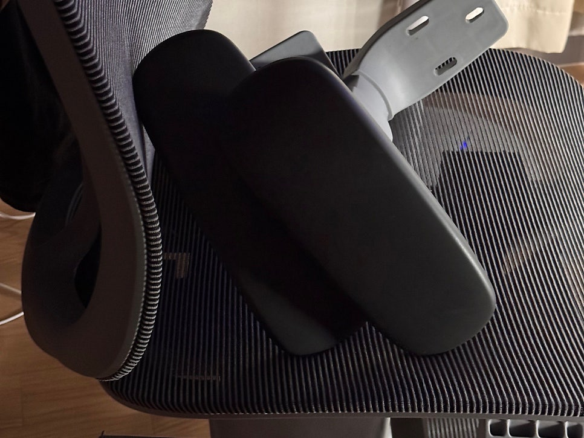

좆같은 팔걸이를 새로 바꾼 의자에서도 떼어버렸다. 도저히 성가셔서 견딜 수가 없었다.

사실 도구 잘못은 아니다. 누군가는 필요했기에 만들어진 것이므로, 도구가 당장 나한테 쓸모가 없다고 해서 욕을 먹어 마땅한 이유는 없다.

그렇지만 사람은 예외다. 존재만으로 욕을 먹는 것. 사람한테는 그런 일이 있을 수 있더라.

사실 내가 2020년대의 사람이라서 그렇지, 조금만 생각하면 그렇게 이상할 일은 아니다. 인권부터 심리학까지, 우리 모두는 당연히 서로를 존중해야 한다는 사회적 개념이 보편적으로 자리잡은 것은 인류 역사를 통틀었을 때 비교적 최근 일이기 때문에.

하지만 놓고 보면 참 아이러니하지. 사람은 사람이기에 그런 대우를 수없이 주고받아온 와중에도, 고작 작업을 돕기 위한 수단으로서 만들어진 도구의 제작법은 장인정신이라는 이름 아래 가치를 보장받으며 수백에서 천 년 가까이 귀하게 전해내려왔다는 게.