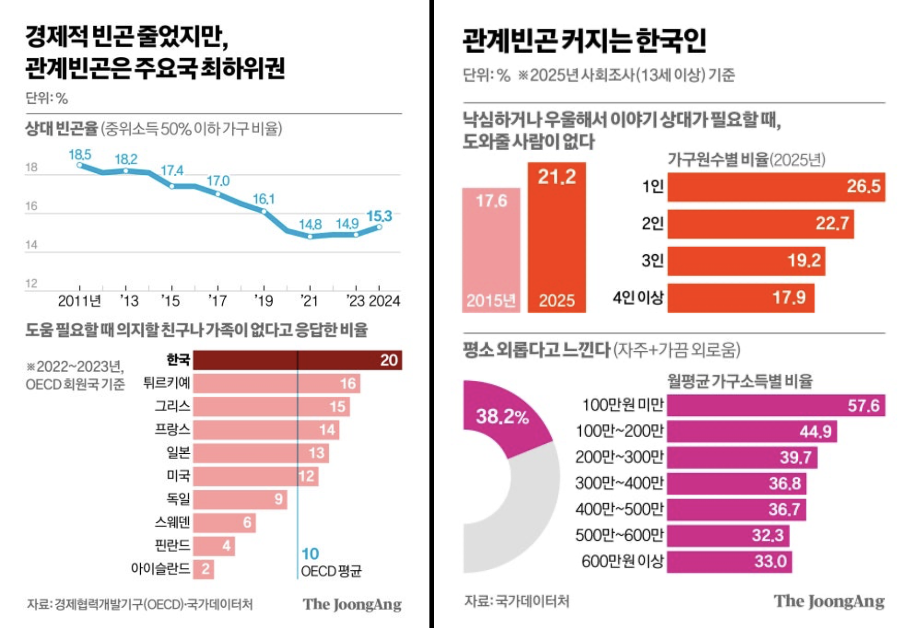

그래픽 출처=동아일보

나든 너든 '왜 살지' 하고 날선 앙심을 품는 것조차 그만둔 지 오래다. 자의가 아니라 어느 순간 돌아보니 그런 상태였다. '탓'을 비롯한 왜곡장 펼치기는 은근 에너지가 많이 들어가는 방어기제 발휘이다. 그리고 지금 나는 그럴 힘이 없다. 컵라면 두 개를 때려부었더니 탄수화물이 혼을 빼놓는 중이다.

<!--more-->

적어도 내가 만나본 사람들 중에서 악인이 있다고 생각하지 않는다. 교육을 덜 받았거나, 동물적으로 생존하기에 유리하거나, 종종 괴인들이 있을 뿐이다. 꿈에 유령처럼 어슬렁대는 원흉들을 내가 너그러이 용서하는 그림은 아니다. 용서를 왜 내가 해. 판단의 대상이 내가 되었으면 되었지. 이 세상은 폐급을 싫어하고 그래서 나는 죄인으로 남았다. 그 길로 지금까지 줄곧 도망 중인 것이다.

시간 개념이 무너져서 이제 누구를 만나거나 자리에 참석할 수가 없다. 약속 시간이 되어서야 눈을 뜨는 나날이 펼쳐진다고 상상해보라. 무력감은 현상이오, 모멸감은 기폭제다. 원래 병원을 다니던 사람인데 내원을 실패한 지조차 한 달이 넘어간다. 예약이라는 시간 기반 사회적 약속에 맞물릴 수가 없으니 진료라는 완충지대에조차 안착하지 못하고 튕겨져나갔다.

내가 좋아하고 선망하던 것들이 더 이상 멋있어보이지 않은 때가 잦았다. 현실을 살지 않은 사람은 그런 상황을 버틸 기반이나 뿌리가 없다. 처음엔 그렇게 생각했다. 삶의 구성에 있어 부차적인 것들이 조금 휘청인다고 덩달아 영향을 받아 무너지는 꼴은 예견된 일이라고. 그런데 어라, 삶을 살지 않은 내가 뭘 안다고 본질과 부차를 논하는지부터 어이가 없었어야 했다. 누군가에게 변두리인 분야가 다른 누군가에겐 세상의 중심일 수 있다. 학술과 산업, 직무까지 갈 것도 없이 당장 사람부터 그런데. 나는 그 무엇도 사고하고 논할 자격이 없는 사람이었다. 심지어 나에 대해서조차도.

그렇다면 도망이나 치료 같은 중요한 문제들은 어쩔 거냐고? 모른다. 무슨 수를 써야 할 지 모른다는 게 아니라 집중해서 생각하는 방법부터 이야기하는 것이다. 일주일에 이불을 빠는 횟수가 세 번이 넘어가고부터 지침과 싫증만이 가득하기에, 이제 문제 해결의 청사진을 그리는 것 같은 중요한 일에 할애할 힘은 남아있지 않는다. 다시 중요하지 않은 부차적인 것들에 눈길을 돌리러.
